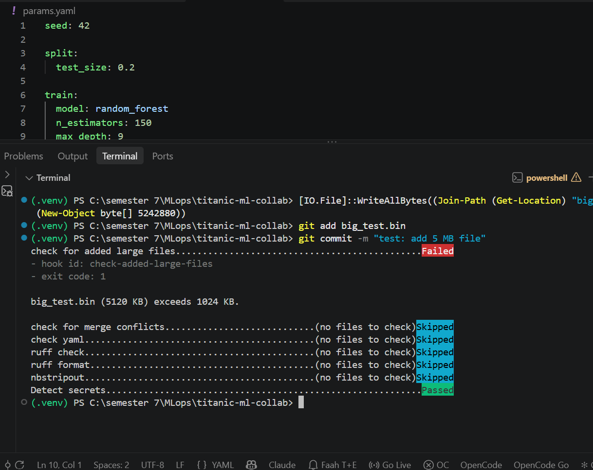
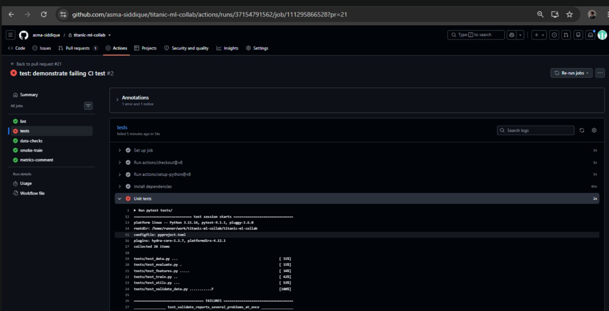
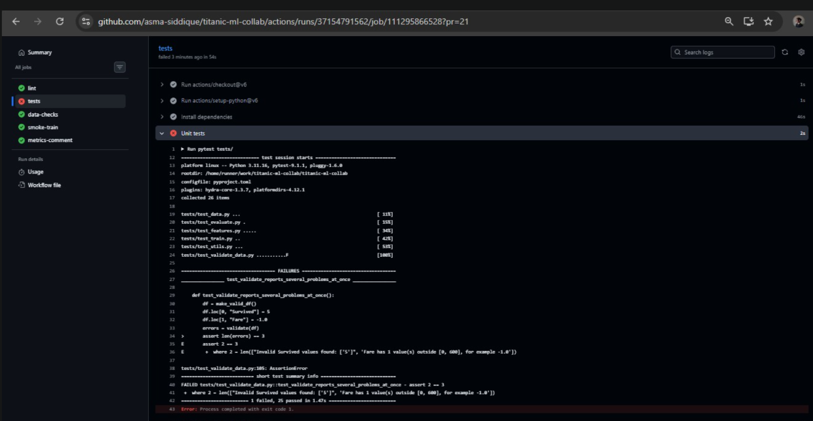
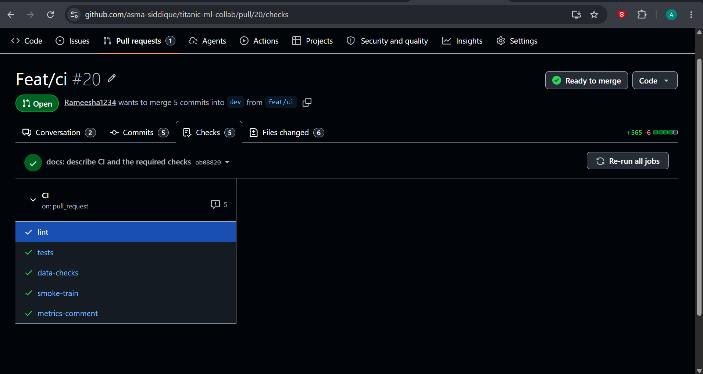

# REPORT: titanic-ml-collab

Git-based collaboration on a Titanic survival classifier, built with Git, DVC and GitHub Actions.
Repository: https://github.com/asma-siddique/titanic-ml-collab

Items marked **TODO** can only be filled in by the team (after the release, or in your own words).
Search for `TODO` before submitting and remove every one.

## 1. Team, roles, dataset and starter code

| Member | GitHub | Roles |
| --- | --- | --- |
| Asma Siddique | `asma-siddique` | Data owner (DVC, data checks, dataset updates); Platform owner, first half (pre-commit hooks, environment, notebooks) |
| Rameesha Shakeel | `Rameesha1234` | Model owner (training pipeline, configs, experiments); Platform owner, second half (CI, PR template) |

Everyone coded and reviewed, whatever their role.

- **Dataset:** the Kaggle Titanic training set, `train.csv` (891 passengers, 12 columns):
  https://www.kaggle.com/c/titanic/data. We downloaded the same file from a public mirror,
  https://github.com/datasciencedojo/datasets (`titanic.csv`). It is versioned with DVC on a DagsHub
  remote. It was changed once, in PR #10: the two missing `Embarked` values (PassengerId 62 and 830)
  were set to `S`.
- **Starter code:** a single-file random-forest script in the style of the public Kaggle Titanic
  tutorials, imported in commit
  [`322d726`](https://github.com/asma-siddique/titanic-ml-collab/commit/322d726) and refactored in
  Phase 6 into the `prepare`, `train` and `evaluate` stages.
- **Tools:** parts of the code, the pipeline scaffolding and the CI workflow were drafted with an AI
  coding assistant (Claude Code), then run, reviewed and committed by the team. Commits made that way
  carry a `Co-Authored-By` trailer.

## 2. Reproducibility of the released model

Release tag: `model-v1.0` on `main`. **TODO:** fill the commit SHA after the tag exists.

| Item | Value |
| --- | --- |
| Release commit SHA | **TODO** (`git rev-parse model-v1.0^{commit}`) |
| `params.yaml` | `seed: 42`, `split.test_size: 0.2`, `train.model: random_forest`, `train.n_estimators: 150`, `train.max_depth: 9` |
| Data `.dvc` hash | `data/raw/titanic.csv.dvc`: md5 `a2d78b1ac5e448c5d3d898cc0c0eee47`, 62,896 bytes <!-- pragma: allowlist secret --> |
| Lock file | `dvc.lock` (committed with the release) |
| Prepared splits in `dvc.lock` | `train.csv` `ac6b3fff61a512507d24421e4f7bf42a`, `test.csv` `152ac801b67ffa9e9ac7bdd54e849777` <!-- pragma: allowlist secret --> |
| Seed | 42, set for the split, the model and Python/NumPy |
| Environment | Python 3.11, exact versions in `requirements.txt` (scikit-learn 1.9.1, pandas 3.0.6, numpy 2.4.6, dvc 3.67.1) |
| Final metrics (test split) | accuracy **0.8380** (0.8379888268156425), F1 **0.7883** (0.7883211678832117) |

**Independent reproduction.** Asma, who did not train the final model, cloned the repository into a
new folder on the `staging` branch and ran `pip install -r requirements.txt`, `dvc pull` and
`dvc repro -f`. **TODO:** paste the resulting `metrics.json` and state whether accuracy and F1 match
exactly. `git_sha` in `metrics.json` is expected to differ: it records the commit the run was made
from. The model file hash can differ across Python versions even when the metrics are identical.

To reproduce from scratch (credentials for the DagsHub remote are needed, kept in
`.dvc/config.local` and never committed):

```
git clone https://github.com/asma-siddique/titanic-ml-collab
cd titanic-ml-collab
git checkout model-v1.0
pip install -r requirements.txt
dvc pull
dvc repro -f
dvc metrics show
```

## 3. Experiments and why the winners were chosen

Rule: the winner is the experiment with the highest test accuracy, with F1 as the tie-breaker. Every
run used `seed: 42` and the same split, so runs differ only in the parameters shown.

**How the model improved, one winner per PR:**

| Step | PR | n_estimators | max_depth | Accuracy | F1 |
| --- | --- | --- | --- | --- | --- |
| Starter pipeline (Phase 6) | #8 | 100 | 6 | 0.8045 | 0.7445 |
| Asma's winner | #9 | 200 | 10 | 0.8268 | 0.7737 |
| Rameesha's winner | #14 | 200 | 8 | 0.8324 | 0.7794 |
| Asma's winner | #16 | 200 | 9 | 0.8380 | 0.7883 |
| Conflict resolution, cheaper model | #17 | 150 | 9 | 0.8380 | 0.7883 |

**Asma, round 1** (`dvc exp show`, baseline 100 trees, depth 6: accuracy 0.8045). Winner: `sharp-zoon`,
promoted in #9.

| Experiment | n_estimators | max_depth | Accuracy | F1 |
| --- | --- | --- | --- | --- |
| `sharp-zoon` (winner) | 200 | 10 | 0.8268 | 0.7737 |
| `piled-rods` | 200 | 4 | 0.8212 | 0.7612 |
| `frore-sash` | 200 | 6 | 0.8101 | 0.7500 |

**Asma, round 2** (baseline 200 trees, depth 8: accuracy 0.8324, F1 0.7794). Winner: `depth-9`,
promoted in #16. Both parameters are set explicitly on every run.

| Experiment | n_estimators | max_depth | Accuracy | F1 |
| --- | --- | --- | --- | --- |
| `depth-9` (winner) | 200 | 9 | 0.8380 | 0.7883 |
| `trees-300` | 300 | 8 | 0.8268 | 0.7704 |
| `depth-12` | 200 | 12 | 0.8212 | 0.7778 |
| `depth-7` | 200 | 7 | 0.8101 | 0.7424 |

**Rameesha** (branch `exp/rameesha-max-depth`, winner promoted in #14: `max_depth` 10 to 8,
accuracy 0.8268 to 0.8324). **TODO (Rameesha):** paste your `dvc exp show --only-changed --md` table
with at least three experiments here.

**Why 150 trees (PR #17).** At depth 9, 100 trees scored 0.8324, worse than the 0.8380 already on
`dev`. 150 trees at depth 9 keeps 0.8380 / 0.7883 with 25% fewer trees than 200, so it is the cheapest
setting that does not lose accuracy.

## 4. Links

- **Data-update PR:** [#10](https://github.com/asma-siddique/titanic-ml-collab/pull/10) (the two
  `Embarked` values), with [#11](https://github.com/asma-siddique/titanic-ml-collab/pull/11) refreshing
  `dvc.lock` afterwards. Moving between the old and new data:
  `git switch --detach a6fbaa7` then `dvc checkout` gives the 60,302-byte file; `git switch dev` then
  `dvc checkout` gives the 62,896-byte file.
- **Conflict-resolution PR:** [#17](https://github.com/asma-siddique/titanic-ml-collab/pull/17).
  Rameesha rebased it onto #16, resolved the `params.yaml` conflict, re-ran the pipeline and
  documented the resolution in a PR comment.
- **"Changes requested" review:** **TODO** (link the review on PR
  [#20](https://github.com/asma-siddique/titanic-ml-collab/pull/20): the empty description).
- **Release PRs:** **TODO** (`release: v1.0` from `dev` into `staging`, then `staging` into `main`).
- **Abandoned `exp/` branches (never merged):**
  [`exp/rameesha-max-depth`](https://github.com/asma-siddique/titanic-ml-collab/tree/exp/rameesha-max-depth)
  and [`exp/asma-max-depth`](https://github.com/asma-siddique/titanic-ml-collab/tree/exp/asma-max-depth).
  They each hold one exploratory commit with the winning parameters. The winner was promoted through a
  `feat/` PR instead (#14, #16), as the workflow requires, and the exp branches then drifted from
  `dev` as the pipeline, the line-ending fix and the parameters moved on. They stay as a record of the
  experiments and are not merged.

## 5. Screenshots

**Blocked large file (Phase 3).** A 5 MB file is stopped by the `check-added-large-files` hook:



**A failing CI check.** A deliberately broken test (PR #21, closed without merging) turns `tests`
red while the other four jobs stay green:





**A passing CI check.** All five jobs green on PR #20:



## 6. Retrospective

| What broke | Cause | What we did | Added to `CONTRIBUTING.md` |
| --- | --- | --- | --- |
| PRs #1 and #3 merged into `main` instead of `dev` | GitHub opens PRs against the default branch (`main`) and rulesets are not enforced on a private repo | Synced `main` back into `dev` (#5); set the default branch to `dev` | Open PRs with `compare/dev...<branch>` and check the base |
| The first push contained later-phase work | Scaffolding was over-built in one go | Redid `main` as a minimal Phase 2 import before protection | One concern per PR, only the phase's work |
| `detect-secrets` blocked DVC hashes and the commit SHA in `metrics.json` | Hex strings look like secrets | Excluded `.dvc`, `dvc.lock` and `metrics.json` | Pre-commit section |
| `dvc status` always said `metrics.json` was modified | Windows wrote CRLF, Git stores LF, so `dvc.lock` held a hash no checkout reproduces (#15) | Write generated files with `newline="\n"` | Generated files stay LF |
| A "winning" experiment inherited another run's settings | `dvc exp run` starts from the previous run's parameters | Re-ran with both parameters set every time | Always pass every parameter to `dvc exp run` |
| Same metrics, different model file hash | Python 3.14 vs 3.11 | Standardised on Python 3.11 | Use Python 3.11 |
| PR template did not show, then started with a hidden BOM (#18, #19) | Templates are read from the default branch only; PowerShell added a BOM | Changed the default branch; removed the BOM | Save files as UTF-8 without BOM |
| The data PR rewrote 852 cells to change 2 values, and left `dvc.lock` stale (#10, #11, #13) | The CSV was re-saved by pandas; no `dvc repro` after the change | Refreshed the lock in follow-up PRs | A data PR includes `dvc repro` results and a minimal diff |
| `dvc exp push` failed with an authentication error | DVC does not use the Git credential manager | Put the experiment tables in this report | n/a |

**What we would standardise.** Create branches from `dev` with a script, run `pre-commit run
--all-files` before every push, and keep one Python version across the team from day one.

## 7. Contributions

**Asma Siddique.** PRs authored: #1 and #3 (merged into `main` by mistake), #2 pre-commit hooks, #5
sync, #6 EDA notebook and `extract_title`, #9 and #16 experiment winners, #11 lock refresh, #15
line-ending fix. **TODO (Asma):** one paragraph in your own words, plus the PRs you reviewed.

**Rameesha Shakeel.** PRs authored: #8 reproducible DVC pipeline, #10 data update, #12 data
validation checks, #13 lock refresh, #14 and #17 experiment winners (#17 resolved the conflict), #18
and #19 PR template, #20 CI workflow. **TODO (Rameesha):** one paragraph in your own words, plus the
PRs you reviewed.
